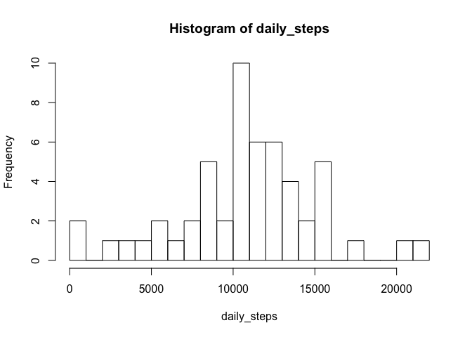
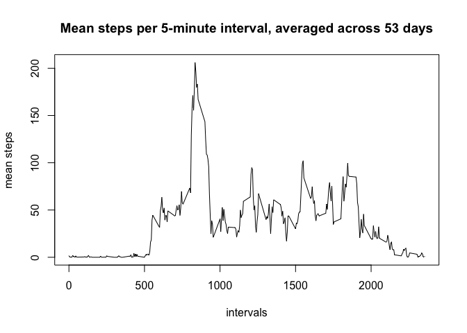
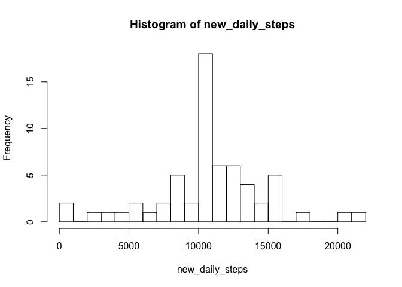
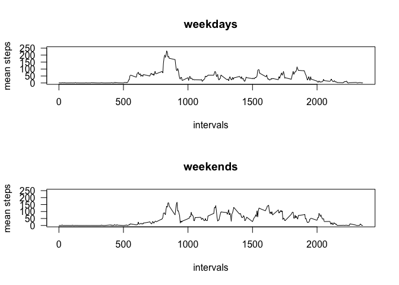

# Reproducible Research: Peer Assessment 1

## Loading and preprocessing the data

```r
## take a subset that excludes the rows with missing (NA) step counts
## then get the totals for each day
all <- read.csv("activity.csv")
sub <- all[!is.na(all$steps),]
daily_steps <- rowsum(sub$steps, sub$date)
hist(daily_steps, breaks=20)
```

 

The histogram shows the frequency of daily step counts. For example:

2 days had counts of zero steps.

10 days had counts of between 10,000 and 11,000 steps.

2 days had counts greater than 20,000 steps.


```r
## count how many days are missing step counts
all_steps <- rowsum(all$steps, all$date)
na_days <- nrow(subset(all_steps, is.na(all_steps)))
```

Over the 61-day period, 8 days had no data and are not represented here.


## What is mean total number of steps taken per day?

```r
mean <- format(mean(daily_steps),2)
median <- format(median(daily_steps),0)
```
The mean number of steps taken per day is 10766.19 steps.

The median number of steps taken per day is 10765 steps.


## What is the average daily activity pattern?

```r
## turn the intervals into factors, then get the totals for each interval
## and divide by 53 days (only count the days for which data is not missing)
sub$interval <- as.factor(sub$interval)
mean_steps <- rowsum(sub$steps, sub$interval)/53
intervals <- rownames(mean_steps)
plot(intervals, mean_steps, type="l", main="Mean steps per 5-minute interval, averaged across 53 days", ylab="mean steps")
```

 

Note that the days with missing data are not included because values will be imputed for the missing data based on these averages (see next section below). Including them here as days with zero step counts would skew the averages downward.


```r
## create a data frame and sort to find the interval with most steps
interval_means <- data.frame(interval=intervals, mean_steps=mean_steps)
sort <- interval_means[order(-interval_means$mean_steps),]
top_interval <- sort$interval[1]
top_steps <- format(sort$mean_steps[1],2)
```

Interval 835 contains 206.1698 steps, which is the most steps of any
interval, on average, across all the days in the dataset *where data is not missing*.


## Imputing missing values

```r
## count the number of rows with missing (NA) step counts
nsub <- all[is.na(all$steps),]
missing_obs <- nrow(nsub)
```

The dataset is missing 2304 observations, i.e. there are 2304 rows with NA step counts. 

2304 = 8 * 288 = 8 days times 288 intervals

This section of the report uses the mean for each 5-minute interval as a proxy for the missing data.


```r
## replace the missing (NA) step counts with the mean for that 5-minute interval
## for each of the 288 intervals, rewrite 8 rows in nsub
for (i in seq_along(1:288)) {
    ## create logical value: does nsub interval match the current interval?
    a <- nsub$interval == interval_means$interval[i]
    ## replace NA with the mean in all 8 rows of nsub for the current interval
    nsub[a,]$steps <- interval_means$mean_steps[i]
}

## compose a new dataset with all 61 days by combining original subset of 53 days
## with NA subset (nsub) of 8 days, now with proxy data instead of NA values
new_temp <- rbind(sub,nsub)
## sort the new dataset first by date, then by interval, to restore original order
new_all <- new_temp[with(new_temp, order(date, interval)),]

## get the new totals for each day
new_daily_steps <- rowsum(new_all$steps, new_all$date)
hist(new_daily_steps, breaks=20)
```

 

The new frequency of daily step counts shows an additional 8 days where the total step count was between 10,000 and 11,000 steps. All other frequencies are the same as in the original histogram.


```r
new_mean <- format(mean(new_daily_steps),2)
new_median <- format(median(new_daily_steps),0)
```
The new mean number of steps taken per day is 10766.19 steps (same as the original mean).

The new median number of steps taken per day is 10766.19 steps.

These results are not surprising because the replacement strategy added 8 days of data each with 10766.19 steps.


## Are there differences in activity patterns between weekdays and weekends?

```r
## convert dates to POSIXlt
new_all$date <- strptime((new_all$date), format = "%Y-%m-%d")

## function to return weekend or weekday (pow = part of week) based on day of the week
wkd <- function(day) {
    if (day == "Saturday" || day == "Sunday") {
        pow <- "weekend"
    }
    else {
        pow <- "weekday"
    }
    pow
}

## apply function to days of the week, determined from the date column
## add new column to dataset: factor variable with values "weekend" or "weekday"
temp <- sapply(weekdays(new_all$date), wkd)
new_all$part_of_week <- as.factor(temp)

## recompute means for weekday intervals and then for weekend intervals
## use options to prevent scientific notation
options("scipen"=100, "digits"=2)
wds <- new_all[new_all$part_of_week=="weekday",]
wes <- new_all[new_all$part_of_week=="weekend",]
ms_wds <- rowsum(wds$steps, wds$interval)/length(unique(wds$date))
ms_wes <- rowsum(wes$steps, wes$interval)/length(unique(wes$date))

## compose new data frames for plotting, both sets of data have 288 rows
weekday <- data.frame(mean_steps=ms_wds)
weekend <- data.frame(mean_steps=ms_wes)
weekday$interval <- intervals
weekend$interval <- intervals
weekday$part_of_week <- rep("weekday",times=288)
weekend$part_of_week <- rep("weekend",times=288)
```

The plots show that people tend to exercise mainly in the morning on weekdays, while exercise occurs throughout the day and starting later in the day on the weekends.


```r
## create a 2-panel plot comparing daily activity for weekdays and weekends
par(mfrow=c(2,1))
plot(weekday$interval, weekday$mean_steps, type="l", 
     main="weekdays", ylab="mean steps", xlab="intervals",
     ylim=c(0,250), las=1)
plot(weekend$interval, weekend$mean_steps, type="l", 
     main="weekends", ylab="mean steps", xlab="intervals",
     ylim=c(0,250), las=1)
```

 


